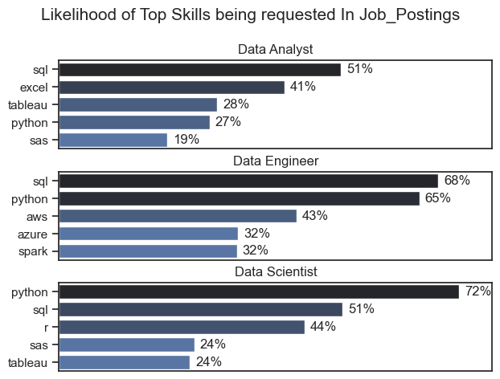
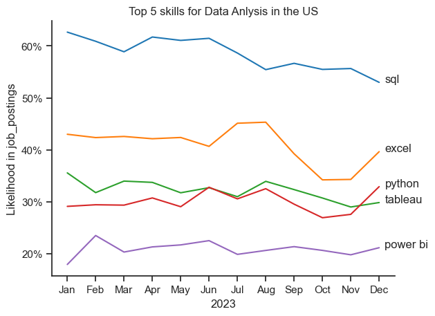
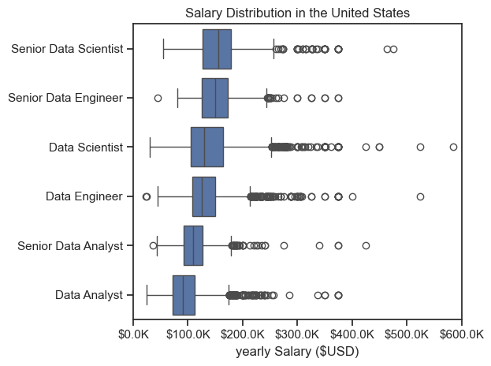
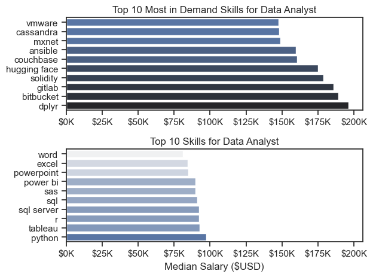

# Data Jobs Analysis
## Project Overview

This project focuses on analyzing and visualizing salary distributions, job market trends, and skill demand for data-related roles in the United States. The analysis includes salary insights, top skills for data analysts, data scientists, and engineers, along with their demand trends in job postings.
## Tools I Used 
1. Python Libraries:

Pandas: Used for data manipulation, cleaning, and analysis.

NumPy: Used for numerical computations and array-based operations.

Matplotlib: Used for creating static, animated, and interactive visualizations.

Seaborn: Used for statistical data visualization and enhancing plots with better aesthetics.

2. Data Sources & Datasets:

Public datasets related to job postings, salary distributions, and skill demand.
## Skills Demonstrated
 Data Analysis, Data Visualization, Business Intelligence, Python Programming 
 Technologies Used: 
 Pandas, NumPy, Matplotlib, Seaborn
## 1. What are the most demanded skills for the Top 3 most popular data roles?
I started my cleaning my data removing null values and duplicates, thereafter exploding the job_skills column to get each skill and thereafter pivoting the data to get the job Skills and their skill_count.
I sorted the job skills by skill_count column in desceding order and filtered top 3 skills using the head method
lastly i used seaborn library to create a barplot to visualize the results.
### View my notebook with detailed steps here:
[2_skills_count.ipynb](2_skills_count.ipynb)
### 1.1 Visualize Data
fig, ax = plt.subplots(len(job_titles), 1)
sns.set_theme(style='ticks')
for i, job_title in enumerate(job_titles):
    df_plot = df_skills_percent[df_skills_percent['job_title_short'] == job_title].head(5)
    #df_plot.plot(kind='barh', x='job_skills', y='skills_perecent', ax=ax[i], title=job_title)
    sns.barplot(data=df_plot, x='skills_perecent',y='job_skills',ax=ax[i],hue='skill_count',palette="dark:b_r")
    ax[i].set_ylabel('')
    ax[i].set_title(job_title)
    ax[i].set_xlabel('')
    ax[i].legend().set_visible(False)
    ax[i].set_xlim(0,78)
    
    
    for n, v in enumerate(df_plot['skills_perecent']):
        ax[i].text(v+1,n,f'{v:.0f}%',va='center')
    if i != len(job_title) -1:
        ax[i].set_xticks([])
    
fig.suptitle('Likelihood of Top Skills being requested In Job_Postings',fontsize=15)
fig.tight_layout(h_pad=0.5)
plt.show()
### 1.2 Results

### 1.3 Insights
1. SQL is Crucial Across All Roles
SQL is the most requested skill for Data Analysts (51%) and Data Engineers (68%).
It is also highly relevant for Data Scientists (51%).
Implication: SQL remains a foundational skill for handling data across all analytics and engineering roles.
2. Python is a Key Skill, Especially for Data Science & Engineering
Python is the most in-demand skill for Data Scientists (72%) and a close second for Data Engineers (65%).
It is less emphasized for Data Analysts (27%), but learning Python can boost career opportunities.
Implication: Python is essential for automation, machine learning, and data engineering tasks.
3. Business Intelligence (BI) & Visualization Skills Matter for Analysts
Tableau (28%) and Excel (41%) are significant for Data Analysts.
These skills are less in demand for Data Scientists and Engineers, emphasizing their role in reporting and business insights.
Implication: Analysts should master visualization tools like Tableau to stand out in data storytelling roles.
4. Cloud & Big Data Tools are Key for Data Engineers
AWS (43%), Azure (32%), and Spark (32%) are specifically valued in Data Engineering roles.
These are not as relevant for Analysts or Scientists, highlighting the focus on cloud-based data infrastructure for engineering.
Implication: Aspiring Data Engineers should focus on cloud computing, big data processing, and distributed systems.
5. R is Still Relevant in Data Science
R (44%) is significant in Data Science, while it's not mentioned for Analysts or Engineers.
Implication: While Python dominates, R remains useful for statistical modeling and academic research.
### Recommendations
SQL & Python are non-negotiable skills for all data roles – mastering both increases job market competitiveness.
Data Analysts should focus on SQL + BI tools (Tableau, Excel) for better reporting skills.
Data Engineers must specialize in cloud platforms (AWS, Azure) and big data tools (Spark).
Data Scientists should master Python and R, with a focus on machine learning and statistical modeling
## 2. How are In_Demand Skills Trending for Data Analyst
### 2.1 Visualize Data
from matplotlib.ticker import PercentFormatter
sns.set_theme(style='ticks')
sns.lineplot(data=df_plot,dashes=False,palette='tab10',legend=False)
sns.despine()
for i in range(5):
    plt.text(11.2, df_plot.iloc[-1,i], df_plot.columns[i])
plt.ylabel('Likelihood in job_postings')
plt.xlabel('2023')
plt.title('Top 5 skills for Data Anlysis in the US')
ax = plt.gca()
ax.yaxis.set_major_formatter(PercentFormatter(decimals=0))
plt.show()
### 2.2 Results

### 2.3 Insights
1. SQL Remains the Most In-Demand Skill
SQL consistently ranks highest, appearing in over 60% of job postings early in the year.
Despite a slight decline in demand over time, it remains the dominant skill for data analysts.
2. Excel Shows Seasonal Fluctuations
Excel demand remains stable in the first half of the year but drops significantly in Q3 (July - October) before rebounding in December.
This could indicate a shift towards more advanced tools like Python or BI platforms in mid-year hiring trends.
3. Python vs. Tableau – A Competitive Trend
Python and Tableau show similar demand levels throughout the year.
Python demand slightly increases towards the end of the year, suggesting a growing shift towards programming and automation in data analysis.
Tableau demand remains steady but dips in Q3, possibly due to seasonal hiring patterns.
4. Power BI Lags but Remains Stable
Power BI consistently has the lowest likelihood in job postings (~20%) but remains relevant.
Despite fluctuations, interest in Power BI is slowly increasing, indicating that Microsoft's BI ecosystem remains valuable for analysts.
### 2.4 Recommendations
SQL is a must-have skill – Analysts should focus on query optimization, database management, and advanced SQL analytics.
Python is gaining momentum, so learning data wrangling, automation, and machine learning with Python can boost career prospects.
BI tools (Tableau & Power BI) still matter, and combining data visualization skills with SQL/Python expertise makes a candidate more competitive.
Excel, though essential, is declining in demand in favor of advanced analytics tools. Learning Python for automation or Power BI for dashboards can enhance job prospects.
## 3. How well do jobs and skills pay for data analysts
### Salary Analysis for Data analyst
### 3.1 Visualization
sns.set_theme(style='ticks')
sns.boxplot(data=df_US_top6,x='salary_year_avg',y='job_title_short',order=job_order)
plt.title('Salary Distribution in the United States')
plt.xlabel('yearly Salary ($USD)')
plt.ylabel('')
plt.xlim(0,600000)
ticks_X = plt.FuncFormatter(lambda y, pos: f'${y/1000}K')
plt.gca().xaxis.set_major_formatter(ticks_X)
plt.tight_layout()

plt.show()
### 3.2  Results

### 3.3 Insights
1. General Salary Trends
Salaries increase with seniority, with Senior Data Scientists earning the highest median salaries.
The spread of salaries is large, indicating significant variability in pay depending on experience, location, and industry.
2. Role-Specific Observations
Senior Data Scientist has the highest median salary and the widest range, with several outliers exceeding $400K+.
Senior Data Engineer follows closely, with a slightly lower median salary but still a wide range.
Data Scientists & Data Engineers have similar salary distributions, though Data Scientists seem to have higher salary ceilings.
Senior Data Analysts & Data Analysts earn less than Data Engineers and Data Scientists, but their salaries still extend beyond $150K in some cases.
3. Presence of Outliers
All roles exhibit outliers, especially at the higher end, suggesting that top professionals in these roles (e.g., at FAANG companies) earn well above the median.
Data Scientist, Data Engineer, and Senior roles all have individuals earning above $400K+, while Data Analysts have fewer extreme high-end salaries.
Key Takeaways
Higher seniority and specialization lead to higher salaries (Senior Data Scientists & Engineers earn the most).
Data Science & Data Engineering roles generally offer higher pay than Data Analytics roles.
Outliers indicate potential high-earning opportunities in top companies, industries, or locations (e.g., Silicon Valley, finance, or AI-focused firms).
### 3.4 Recommendations
For Data Analysts: Upskilling in machine learning, cloud computing, or data engineering could help transition to higher-paying roles.
For Aspiring Data Scientists: Specializing in deep learning, MLOps, or advanced statistical modeling could help maximize earnings.
For Data Engineers: Gaining expertise in big data tools, cloud platforms (AWS, GCP), and pipeline automation can push salaries higher.
## 4. Top 10 most in demand skills vs Top 10 skills for data analyst
### 4.1 Visualization
fig, ax = plt.subplots(2,1)
sns.barplot(data=df_DA_US_top_skills,x='median',y=df_DA_US_top_skills.index,ax=ax[1],hue='median',palette='light:b')
sns.set_theme(style='ticks')
ax[1].set_title('Top 10 Skills for Data Analyst')
#df_DA_US_top_skills.plot(kind='barh',y='median',ax=ax[1],legend=False,title='Top 10 Skills for Data Analyst')
ax[1].invert_yaxis()
#df_DA_US_top_pay.plot(kind='barh',y='median',ax=ax[0],legend=False,title='Top 10 Most in Demand Skills for Data Analyst')
ax[0].set_title('Top 10 Most in Demand Skills for Data Analyst')
sns.barplot(data=df_DA_US_top_pay,x='median',y=df_DA_US_top_pay.index,ax=ax[0],hue='median',palette='dark:b_r')
ax[1].legend().remove()
ax[0].legend().remove()
ax[0].invert_yaxis()
ax[0].set_ylabel('')
ax[0].set_xlabel('')
ax[0].xaxis.set_major_formatter(plt.FuncFormatter(lambda x, _: f'${int(x/1000)}K'))
ax[1].set_ylabel('')
ax[1].set_xlabel('Median Salary ($USD)')
ax[1].set_xlim(ax[0].get_xlim())
ax[1].xaxis.set_major_formatter(plt.FuncFormatter(lambda x, _: f'${int(x/1000)}K'))
fig.tight_layout()
### 4.2 Results

### 4.3 Insights
1. Most In-Demand Skills for Data Analysts
The top 10 most in-demand skills include VMware, Cassandra, MXNet, Ansible, Couchbase, Hugging Face, Solidity, GitLab, Bitbucket, and Dplyr.
These are mostly technical and cloud-based tools, indicating that the demand for machine learning, cloud computing, and DevOps expertise is growing for data analysts.
The highest-paying skills exceed $175K per year, with Dplyr (R package for data manipulation) being one of the highest.
2. Top 10 Skills for Data Analysts (General)
These include Word, Excel, PowerPoint, Power BI, SAS, SQL, SQL Server, R, Tableau, and Python.
Traditional skills such as Excel and PowerPoint have lower median salaries.
Python, R, Tableau, and SQL offer higher earning potential, with Python being the most lucrative.
Key Takeaways
High-paying data analytics jobs require advanced technical skills such as cloud computing, machine learning frameworks (MXNet, Hugging Face), and DevOps tools (Bitbucket, GitLab).
Basic data analytics tools (Excel, Word, PowerPoint) are useful but offer lower salaries. Skills like Power BI, SQL, and Tableau can enhance earning potential.
Python remains the top-paying skill for data analysts, making it a must-learn tool for those seeking higher salaries.
R and Dplyr are still relevant, especially in statistics-heavy roles.
### 4.4 Recommendations
Aspiring data analysts should focus on Python, SQL, and Tableau for a strong foundation.
Learning cloud computing, AI frameworks, and DevOps tools can significantly increase earning potential.
Excel and Power BI remain crucial but should be complemented with advanced analytics and automation skills.